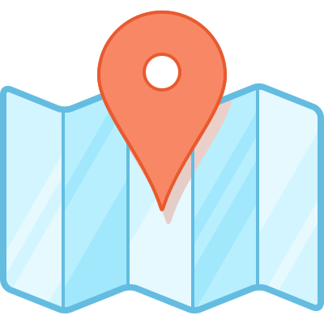

# Netlify Geolocation  

Server that determines your physical location by looking at headers sent to Netlify edge functions.

Try it with: [Netlify](https://netlify-geo.redirect2.me/)

Also see a more detailed [comparison of geolocation providers](https://resolve.rs/ip/geolocation.html)

## How it works

This application is just a simple app that shows various HTTP header values.

## Running it yourself

It is a trivial TypeScript application.  

LATER

## Contributions

Contributions are welcome!  If you know of any other similar CDNs/services, let me know & I will add them in!

## API

There is a simple JSON/JSONP API that is free for light, non-commercial use.  This is such a trivial application that you should run your own copy (or make your own  version) for anything serious.  Both Netlify has a generous free plan (which is what I'm using).

Send a `callback` parameter to get JSONP instead of JSON.

- [`/api/cfw.json`](https://aws-geo.redirect2.me/api/cfw.json)

## License

[GNU Affero General Public License v3.0](LICENSE.txt)

## Credits

- LATER: typescript, npm, nodeping, etc
